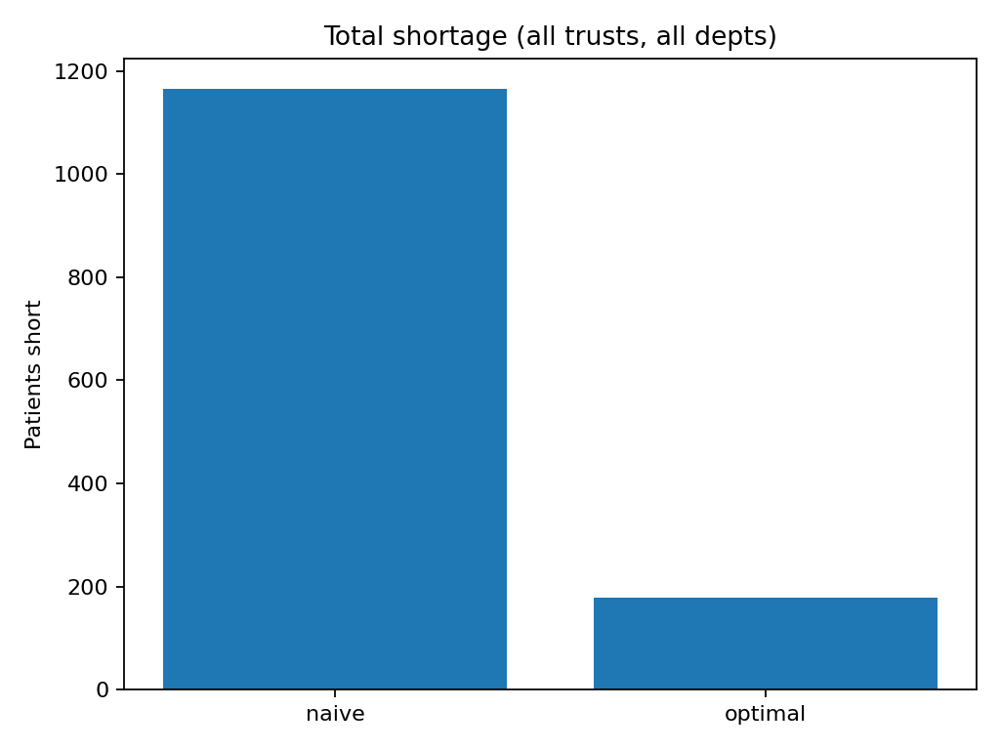
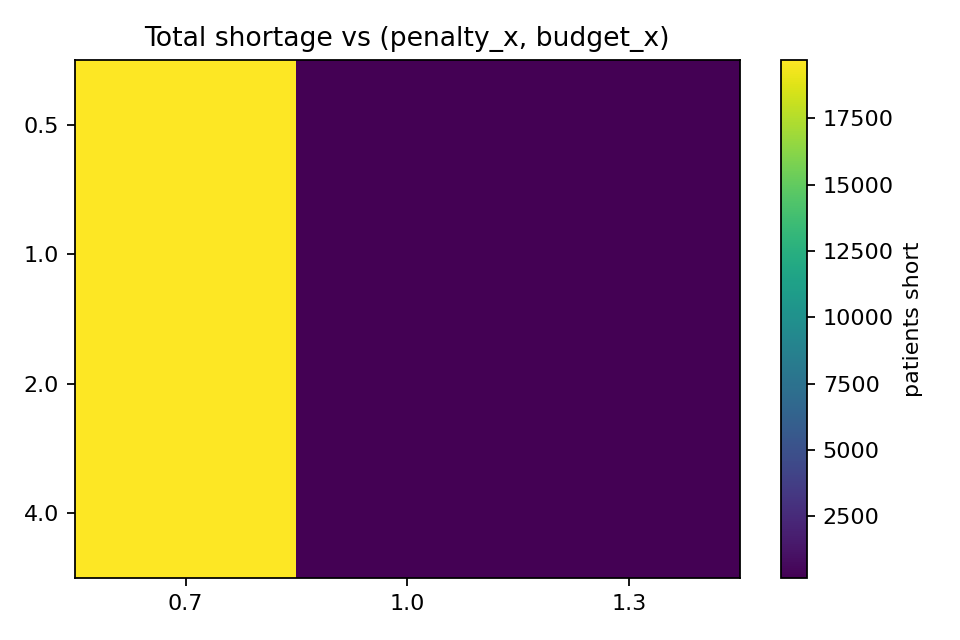
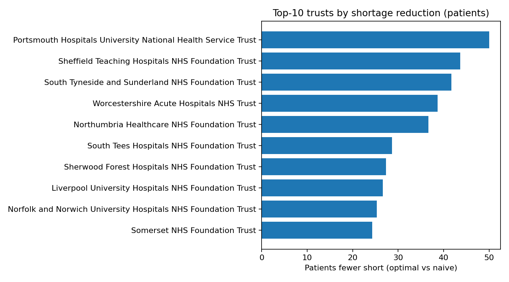

# WardOpt
An end to end pipeline that predicts the number of patients each month while optimizing efficient use of nurses and beds for each trust and department. Includes integer-like staffing, policy minimum service levels, overflow beds, sensitivity analysis, and a Streamlit dashboard. Shortage has gone down by about 85% compared to naive on recent data.

  

**Figure 1. Sensitivity heatmap (shortage vs penalty×budget).**  

**Figure 2. Top-10 trusts by shortage reduction (patients).**  

---

## Features
- **Forecasting** (lag-1, MA(3), Random Forest; auto-selects best per series)
- **Convex allocation** with clinical constraints (beds, patients-per-nurse)
- **Policy levers**: department-specific costs & minimum service levels
- **Overflow units**: temporary beds with a cost and per-dept caps
- **Integer-like staffing**: continuous solve → rounding → recompute
- **Sensitivity analysis**: shortage vs budget × penalty
- **Dashboard**: compare Base / Policy / Overflow / Integer plans / export CSVs
